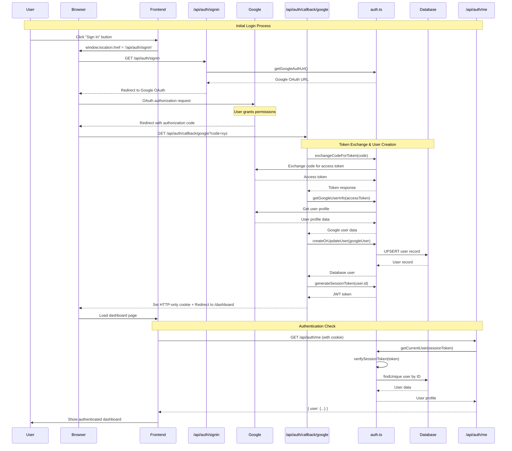
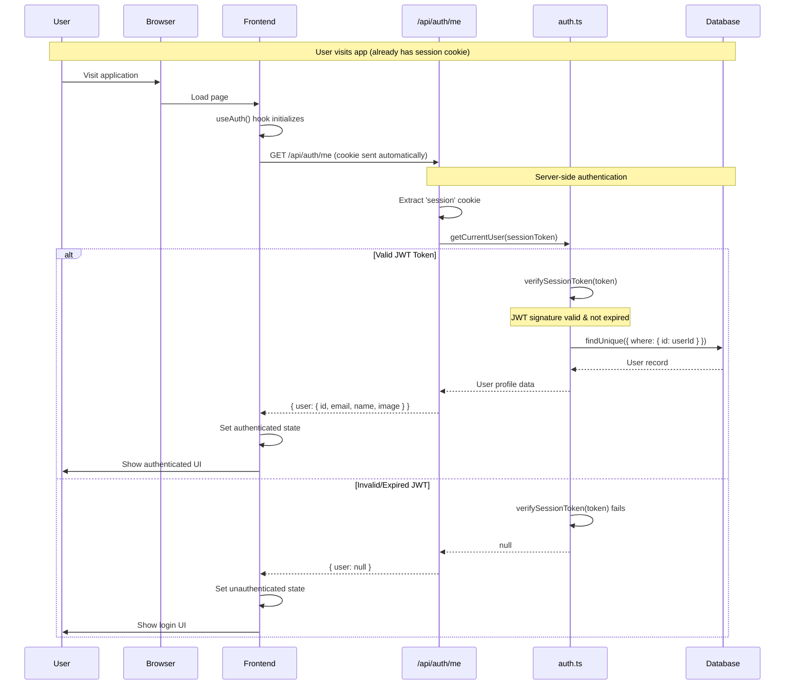
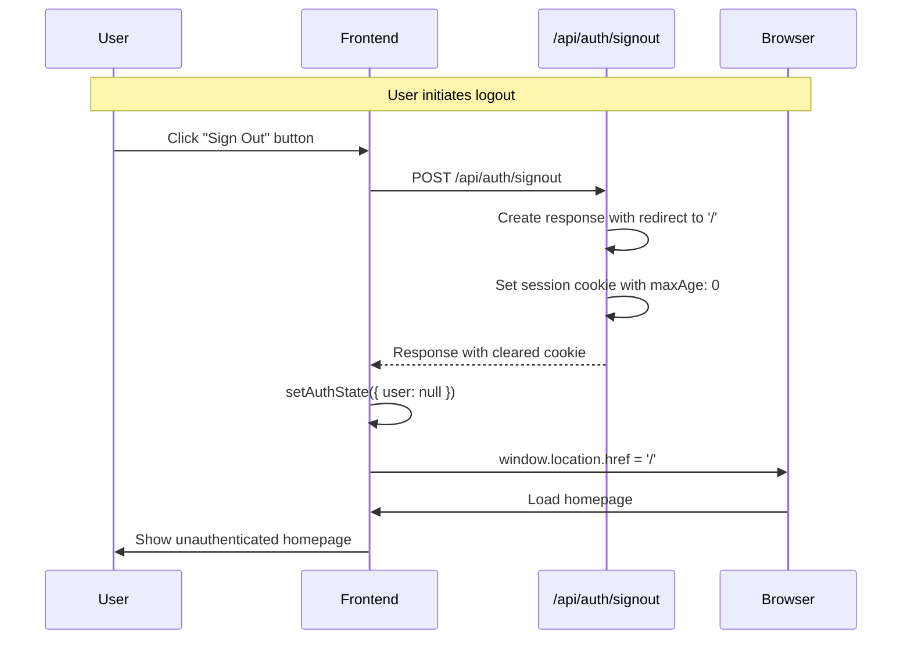
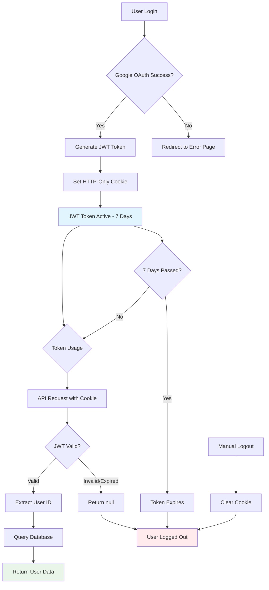
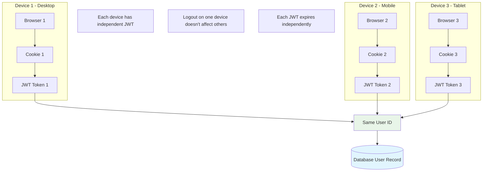

# 🔄 Authentication Flow Diagrams

## 🚀 Complete Sign-In Flow



## 🔍 Authentication Check Flow (Return User)



## 🚪 Sign-Out Flow



## 🔐 JWT Token Lifecycle



## 🔄 Multi-Device Session Management



## 🛡️ Security Layer Breakdown



```mermaid
graph LR
    subgraph "Client Side"
        A[Browser] --> B[HTTP-Only Cookie]
        B --> C[Cannot Access via JavaScript]
    end
    
    subgraph "Network"
        D[HTTPS Only] --> E[Secure Cookie Flag]
        E --> F[SameSite Protection]
    end
    
    subgraph "Server Side"
        G[JWT Verification] --> H[Secret Key Validation]
        H --> I[Expiration Check]
        I --> J[User ID Extraction]
    end
    
    subgraph "Database"
        K[User Lookup] --> L[Profile Data]
    end
    
    C --> D
    F --> G
    J --> K
    
    style C fill:#ffcdd2
    style F fill:#fff3e0
    style I fill:#e8f5e8
    style L fill:#e1f5fe
```

## 🔧 Function Call Chain

```mermaid
graph TD
    A[User Action] --> B{Action Type}
    
    B -->|Sign In| C[useAuth.signIn()]
    B -->|Check Auth| D[useAuth.fetchCurrentUser()]
    B -->|Sign Out| E[useAuth.signOut()]
    
    C --> F[/api/auth/signin]
    F --> G[getGoogleAuthUrl()]
    G --> H[Google OAuth Flow]
    H --> I[/api/auth/callback/google]
    I --> J[exchangeCodeForToken()]
    J --> K[getGoogleUserInfo()]
    K --> L[createOrUpdateUser()]
    L --> M[generateSessionToken()]
    
    D --> N[/api/auth/me]
    N --> O[getCurrentUser()]
    O --> P[verifySessionToken()]
    P --> Q[Database Query]
    
    E --> R[/api/auth/signout]
    R --> S[Clear Cookie]
    
    style G fill:#e3f2fd
    style M fill:#e8f5e8
    style P fill:#fff3e0
    style S fill:#ffebee
```

## 📊 Data Flow Architecture

```mermaid
graph TB
    subgraph "Frontend Layer"
        A[React Components] --> B[useAuth Hook]
        B --> C[Auth State Management]
    end
    
    subgraph "API Layer"
        D[/api/auth/signin] 
        E[/api/auth/callback/google]
        F[/api/auth/me]
        G[/api/auth/signout]
    end
    
    subgraph "Business Logic"
        H[auth.ts Library]
        I[JWT Functions]
        J[Google OAuth Functions]
        K[User Management]
    end
    
    subgraph "Data Layer"
        L[(PostgreSQL/MySQL)]
        M[User Table]
        N[Prisma ORM]
    end
    
    subgraph "External Services"
        O[Google OAuth2]
        P[Google User Info API]
    end
    
    C --> D
    C --> F
    C --> G
    D --> H
    E --> H
    F --> H
    G --> H
    
    H --> I
    H --> J
    H --> K
    
    J --> O
    J --> P
    K --> N
    N --> L
    L --> M
    
    style C fill:#e8f5e8
    style H fill:#e1f5fe
    style N fill:#fff3e0
    style O fill:#ffebee
```

This visual documentation complements the detailed written documentation and provides clear visual representations of your authentication system's architecture and flow.