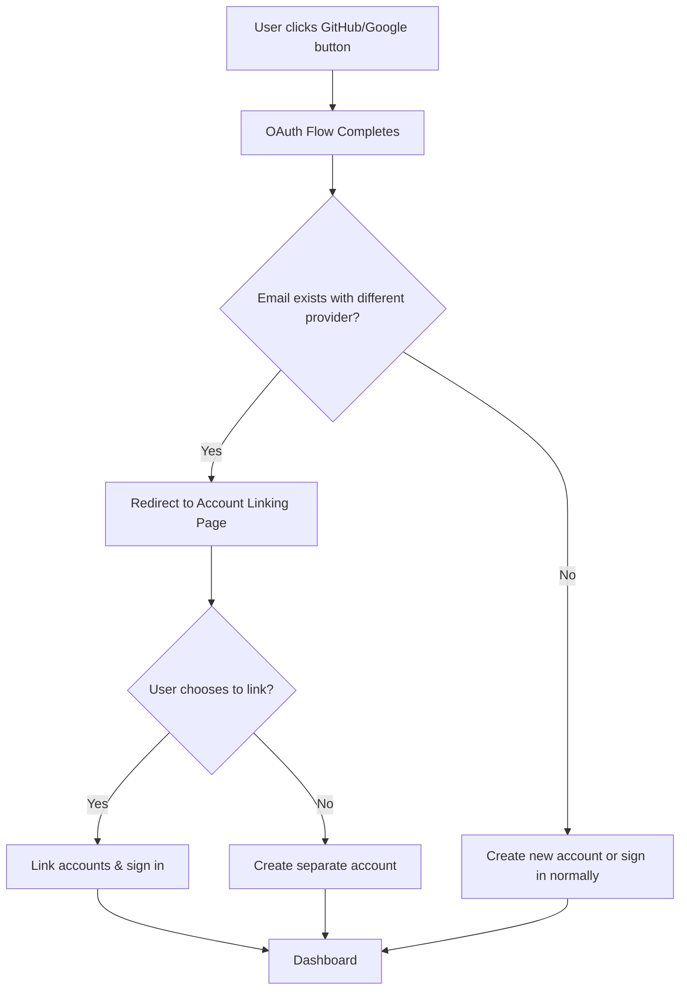

# GitHub OAuth Integration Plan

## 🎯 Overview
This document outlines the plan to add GitHub OAuth as an additional identity provider alongside the existing Google OAuth implementation, with intelligent account linking capabilities.

## 🔄 Account Linking Flow



## 🗃️ Database Schema Changes

### Current Schema
```prisma
model User {
  id          String   @id @default(cuid())
  email       String   @unique
  name        String?
  image       String?
  googleId    String?  @unique
  createdAt   DateTime @default(now())
  updatedAt   DateTime @updatedAt
}
```

### Updated Schema
```prisma
model User {
  id              String   @id @default(cuid())
  email           String   @unique
  name            String?
  image           String?
  googleId        String?  @unique
  githubId        String?  @unique
  primaryProvider String?  // 'google' or 'github' - tracks which was used first
  linkedProviders String[] // Array of linked providers ['google', 'github']
  createdAt       DateTime @default(now())
  updatedAt       DateTime @updatedAt
}
```

## 🎨 User Experience Specifications

### Sign-in Page Layout
```
┌─────────────────────────────────────┐
│          Welcome Back              │
│                                     │
│  ┌─────────────────────────────────┐ │
│  │  🔵 Continue with Google        │ │
│  └─────────────────────────────────┘ │
│                                     │
│  ┌─────────────────────────────────┐ │
│  │  ⚫ Continue with GitHub        │ │
│  └─────────────────────────────────┘ │
└─────────────────────────────────────┘
```

### Account Linking Page
```
┌─────────────────────────────────────┐
│        Account Found               │
│                                     │
│  An account already exists with     │
│  john@example.com using Google.     │
│                                     │
│  Would you like to link your        │
│  GitHub account to your existing    │
│  Google account?                    │
│                                     │
│  ┌──────────┐  ┌──────────────────┐ │
│  │   Yes    │  │  No, Keep Separate│ │
│  └──────────┘  └──────────────────┘ │
└─────────────────────────────────────┘
```

## 🔧 Implementation Components

### 1. GitHub OAuth Configuration
```typescript
// Addition to src/lib/auth.ts
export const GITHUB_AUTH_CONFIG = {
  clientId: process.env.GITHUB_CLIENT_ID!,
  clientSecret: process.env.GITHUB_CLIENT_SECRET!,
  redirectUri: `${process.env.NEXTAUTH_URL}/api/auth/callback/github`,
  scope: 'user:email',
  authUrl: 'https://github.com/login/oauth/authorize',
  tokenUrl: 'https://github.com/login/oauth/access_token',
  userInfoUrl: 'https://api.github.com/user',
};
```

### 2. Enhanced OAuth Callback Flow
```typescript
// Logic for src/app/api/auth/callback/[provider]/route.ts
export async function GET(request: NextRequest) {
  // ... existing OAuth flow ...
  
  // After getting user info from provider
  const existingUser = await findUserByEmail(providerUser.email);
  
  if (existingUser && !existingUser[`${provider}Id`]) {
    // Account exists with different provider
    const linkingToken = generateLinkingToken({
      email: providerUser.email,
      provider,
      providerUser,
      existingUserId: existingUser.id
    });
    
    return NextResponse.redirect(
      `${process.env.NEXTAUTH_URL}/auth/link-account?token=${linkingToken}`
    );
  }
  
  // ... continue with normal flow ...
}
```

### 3. Account Linking Token System
```typescript
// Enhanced auth library functions
export async function findUserByEmail(email: string) {
  return await prisma.user.findUnique({
    where: { email },
    select: {
      id: true,
      email: true,
      googleId: true,
      githubId: true,
      primaryProvider: true,
      linkedProviders: true
    }
  });
}

export function generateLinkingToken(data: LinkingData): string {
  return jwt.sign(data, process.env.JWT_SECRET!, { expiresIn: '10m' });
}

export async function linkProviderToUser(userId: string, provider: string, providerId: string) {
  const updateData = {
    [`${provider}Id`]: providerId,
    linkedProviders: {
      push: provider
    }
  };
  
  return await prisma.user.update({
    where: { id: userId },
    data: updateData
  });
}
```

## 📁 Files to Create/Modify

### New Files
1. `src/app/api/auth/callback/github/route.ts` - GitHub OAuth callback
2. `src/app/auth/link-account/page.tsx` - Account linking UI
3. `src/app/api/auth/link-accounts/route.ts` - Account linking API

### Modified Files
1. `prisma/schema.prisma` - Add GitHub fields
2. `src/lib/auth.ts` - Add GitHub OAuth functions
3. `src/app/api/auth/signin/route.ts` - Add provider parameter support
4. `src/hooks/useAuth.ts` - Update signIn function
5. Sign-in UI components - Add GitHub button

## 🔐 Environment Variables Required

```env
# Existing
GOOGLE_CLIENT_ID=your_google_client_id
GOOGLE_CLIENT_SECRET=your_google_client_secret

# New GitHub OAuth
GITHUB_CLIENT_ID=your_github_client_id
GITHUB_CLIENT_SECRET=your_github_client_secret

# Existing
NEXTAUTH_URL=http://localhost:3000
JWT_SECRET=your_jwt_secret
DATABASE_URL=your_database_url
```

## 🔄 Implementation Phases

### Phase 1: Database & Configuration
- [ ] Update Prisma schema with GitHub fields
- [ ] Run database migration
- [ ] Add GitHub environment variables

### Phase 2: GitHub OAuth Setup
- [ ] Add GitHub OAuth configuration to auth.ts
- [ ] Create GitHub OAuth callback route
- [ ] Update signin route with provider support

### Phase 3: Account Linking System
- [ ] Implement linking token generation/verification
- [ ] Create account linking detection logic
- [ ] Build account linking API endpoint

### Phase 4: User Interface
- [ ] Create account linking page component
- [ ] Update sign-in page with both provider buttons
- [ ] Add provider selection to useAuth hook

### Phase 5: Testing & Refinement
- [ ] Test OAuth flows for both providers
- [ ] Test account linking scenarios
- [ ] Handle edge cases and error states

## 🛡️ Security Considerations

### Linking Token Security
- Short expiration (10 minutes)
- Single-use tokens
- Encrypted provider data
- Verification of email ownership

### Account Protection
- Prevent unauthorized account linking
- Audit trail for account changes
- Secure token validation

## 📱 User Profile Enhancements

Users will be able to see:
- Which providers are linked to their account
- Primary provider used for registration
- Option to manage linked accounts (future enhancement)

---

This plan provides a comprehensive approach to adding GitHub OAuth with intelligent account linking that respects user choice and maintains security best practices.